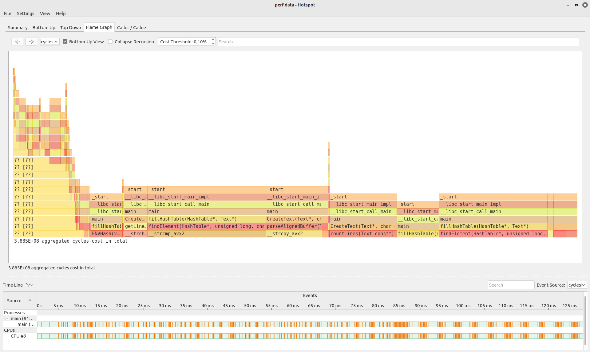
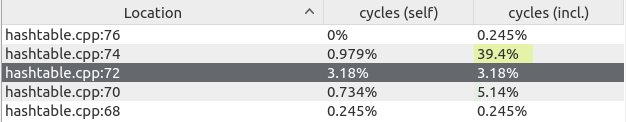

# Хэш таблица

## Цель

Написать рабочую хеш таблицу, ускорить ее медленные места, используя
  -inline assembly
  -интринсики

## Начало

Для тестирования хеш таблицы я использовал текст Шекспира, включющий ~30000 уникальных слов.

# Сравнение хеш функций

Обозначим рассматриваемые хеш функции

1. Zero hash
2. ASCII код первого символа слова
3. Длина слова
4. Сумма ASCII кодов всех символов
5. Сумма ASCII кодов всех символов поделенная на его длину
6. crc32
7. FNV

### Zero hash

Эта хеш функция всегда возвращает 0

%20.png)

### ASCII код первого символа слова

Так как все слова в тексте начинаются с маленькой буквы, заняты будут только ячейки с 97 по 122.

-imageonline.co-merged.png)

### Длина слова

Длина большинства слов в тексте находится в пределах 20, а самым длинным словом оказалось "honorificabilitudinitatibus" - 27 символов.
-imageonline.co-merged.png)

### Сумма ASCII кодов всех символов

Здесь мы можем наблюдать неплохое распределение, а пик в районе 900 обосновывается тем, что слова в среднем состоят из ~9 слов с ASCII кодом ~100.


### Сумма ASCII кодов всех символов поделенная на его длину

Стало только хуже

-imageonline.co-merged.png)

### CRC32

Crc32 - очень популярная хеш функция, работает быстро и эффективно.


### FNV

Fowler–Noll–Vo. Простая и эффективная (https://en.wikipedia.org/wiki/Fowler%E2%80%93Noll%E2%80%93Vo_hash_function).

На С выглядит так:

```
uint64_t FNVHash (const char* str, int length)
    {
    uint64_t FNVprime = 0x811C9DC5;

    uint64_t hash = 0;

    for (uint64_t i = 0; i < keyLength; i++)
        {
        hash *= FNVprime;
        hash ^= key[i];
        }

    return hash;
    }

```


|   N    | хеш                                       | дисперсия    |
|:------:|:-----------------------------------------:|:------------:|
| **1**  | $Zero$                                    | $ 171000 $   |
| **2**  | $Длина_слова$                             | $ 20000  $   |
| **3**  | $Сумма_ASCII_кодов_всех_символов / длину$ | $ 19400  $   |
| **4**  | $ASCII_код_первого_символа_слова$         | $ 9800   $   |
| **5**  | $Сумма_ASCII_кодов_всех_символов$         | $ 290    $   |
| **6**  | $CRC32$                                   | $ 9.81   $   |
| **7**  | $FNV$                                     | $ 9.76   $   | 

Как мы видим, FNV - самая эффективная функция, но разница между ней и crc32 очень небольшая, поэтому я буду использовать crc32.

# Оптимизация

Все измерения проводились с -О2 и размером таблицы 8192.

База:

| номер теста     | количество тиков / 10^8 |
|-------------|-------------|
| **1**           | $ 29.0  $ |
| **2**           | $ 28.7  $ |
| **3**           | $ 29.0 $ |
| **4**           | $ 38.1 $ |
| **5**           | $ 29.3  $ |
| $ в среднем $ | $ 30.8 $ | 

## strcmp

Нужно понять, что оптимизировать. Для этого я использовал `Hotspot` - графическое отображение для Linux `perf`.



Очень большое количество времени уходит на сравнение слов. 
Поскольку в тексие нет слов больше 27 букв, можно использовать 1 AVX2 сравнение вместо AVX512
Получился такой код:

```
int mystrcmp (const char* s1, const char* s2)
    {
    __m256i s1_ = _mm256_loadu_si256((const __m256i*) s1);
    __m256i s2_ = _mm256_loadu_si256((const __m256i*) s2);

    return ~(_mm256_movemask_epi8(_mm256_cmpeq_epi8(s1_, s2_))); 
    }
```

Результаты:

| N | количество тиков / 10^8          |
|-------------|----------------|
| **1**           | $ 24.1 $     |
| **2**           | $ 26.0 $     |
| **3**           | $ 24.6 $     |
| **4**           | $ 26.0 $     |
| **5**           | $ 31.8 $     |
| $ average $ | 26.5 |


### На 13% лучше, чем база 
 
## %

Я заметил, что в функции `fillHashTable` была одна строка, которая выполнялась заметно дольше других, там использовалась операция взятия остатка



Эта операция такая длинная из за инструкции idiv. Вместо этого мы можем сделать размер хеш таблицы равным 2^n и использовать побитовое "и".
```
x mod 2^n <=> x & (2^n - 1)
```

Напишем это при помощи inline assembly

```
asm volatile 
        (
         "and %1, %0\n\t"

         : "+rm" (hash)

         : "rm" (htSize - 1)
        );
```

Результаты:

| N    |      количество тиков / 10^8    |
|-------------|----------------|
| **1**           | $ 22.3 $     |
| **2**           | $ 23.0 $     |
| **3**           | $ 23.0 $    |
| **4**           | $ 23.4 $     |
| **5**           | $ 22.6 $     |
| $Среднее$ | $22.8$ |

### На 15% быстрее предыдущей оптимизации!

### Ускорить crc32

Мы можем кодировать сразу по 8 байт, используя интринсик `_mm_crc32_u64`
Но сначала нам нужно выровнять данные в памяти.

```
const size_t ALIGNED_BYTES = 32;

uint64_t CRC32Hash_64 (const void* seed, size_t seedLength)
{
    uint64_t hash = 0xDEADDEAD;

    const char* key = (const char*) seed;

    for (size_t i = 0; i < ALIGNED_BYTES; i += 8) 
    {
        hash = _mm_crc32_u64(hash, *(unsigned long long*)(key + i));
	}

	return hash;
}
```
измерения в таблице приведены в количестве тиков / 10^8

|N  | База | strcmp | % | crc32 |
|---------|--------------------------|------------------------|----------------------------------|-------------------------------|
| **1**       | $ 29.0 $                      | $ 24.1 $                    | $ 22.3 $                              |$ 21.5 $                           |
| **2**       | $ 28.7 $                      | $ 26.0 $                    | $ 23.0 $                              |$ 23.1 $                           |
| **3**       | $ 29.0 $                     | $ 24.6 $                    | $ 23.0 $                              |$ 22.2 $                           |
| **4**       | $ 38.1 $                     | $ 26.0 $                    | $ 23.4 $                              |$ 22.0 $                           |
| **5**       | $ 29.3 $                     | $ 31.8 $                    | $ 22.6 $                              |$ 21.5 $                           |
|  среднее  | $ 30.8              | $ 26.5 $                    | $ 22.8 $                              |$ 22.1 $                           |
|  буст (отн. базы)    |$ 1.00x $                    | $ 1.16x $                  | $ 1.35x $                             | $ 1.39x $                         |

### В итоге я ускорил хеш таблицу на 39%!

